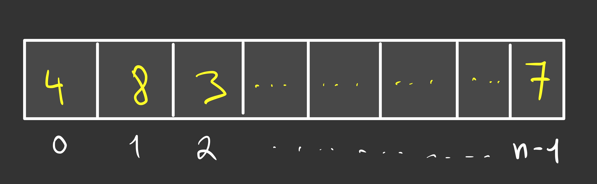
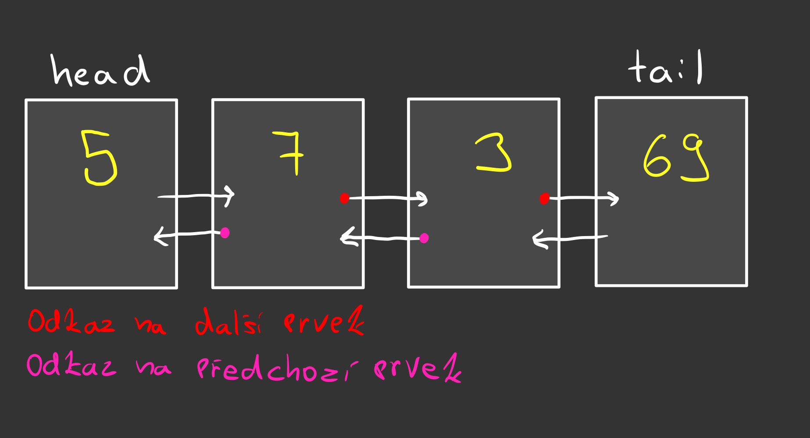

# 03. Pole a kolekce – seznam, množina a mapa

## Obsah
- Pole
- Seznam (List)
- Množina (Set)
- Mapa (Map)
- Lineární spojové seznamy
- Permutace
- Vhodné užití jednotlivých struktur
- Úskalí a efektivita

## Obecné srovnání sturktur
| Datová struktura    | Přidání                          | Odebrání                         | Nalezení                           | Poznámky                                                                 |
|---------------------|----------------------------------|----------------------------------|------------------------------------|-------------------------------------------------------------------------|
| **Pole (Array)**    | O(n)                             | O(n)                             | O(1) přístup, O(n) vyhledávání     | Pevná velikost, efektivní přístup přes index                            |
| **ArrayList**       | O(1)* na konec, O(n) jinak       | O(n)                             | O(n)                               | Dynamická velikost, rychlý přístup přes index                           |
| **LinkedList**      | O(1) na začátek/konec            | O(1) na začátek/konec            | O(n)                               | Efektivní vkládání/mazání, pomalý přístup                              |
| **HashSet**         | O(1) průměrně, O(n) nejhůř       | O(1) průměrně, O(n) nejhůř       | O(1) průměrně, O(n) nejhůř         | Unikátní prvky, negarantuje pořadí, závislé na kvalitě hashCode()       |
| **TreeSet**         | O(log n)                         | O(log n)                         | O(log n)                           | Udržuje prvky seřazené, vhodné pro rozsahové dotazy                     |
| **HashMap**         | O(1) průměrně, O(n) nejhůř       | O(1) průměrně, O(n) nejhůř       | O(1) průměrně, O(n) nejhůř         | Klíče musí být unikátní, velmi rychlé operace                           |
| **TreeMap**         | O(log n)                         | O(log n)                         | O(log n)                           | Klíče jsou seřazené, ideální pro rozsahy nebo tříděné výpisy            |


## Pole

Pole je jednoduchá datová struktura, která:
- Obsahuje prvky stejného typu
- Má pevně danou velikost při vytvoření (v Javě nelze změnit)
- Umožňuje přímý přístup k prvkům pomocí indexu (konstantní časová složitost O(1))
- Je uložena souvisle v paměti



**Výhody:**
- Rychlý přístup k libovolnému prvku
- Jednoduchá implementace
- Efektivní využití paměti

**Nevýhody:**
- Pevná velikost (nelze dynamicky měnit)
- Přidávání nebo odebírání prvků není efektivní (vyžaduje vytvoření nového pole)
- Plýtvání pamětí, pokud není pole zcela využito

**Operace:**
- Přístup k prvku: O(1)
- Vyhledávání prvku: O(n)
- Přidání/odebrání prvku: O(n) - kvůli nutnosti vytvořit nové pole

```java
// Deklarace a inicializace pole
int[] pole = new int[10];  // Pole pro 10 celých čísel
int[] inicializovanéPole = {1, 2, 3, 4, 5};  // Přímá inicializace
```

## Seznam (List)

Seznam je kolekce, která:
- Uchovává prvky v určitém pořadí
- Umožňuje duplicitní prvky
- Má dynamickou velikost (na rozdíl od pole)

### ArrayList
Implementace seznamu pomocí pole:
- Poskytuje přímý přístup k prvkům
- Interně používá pole, které se automaticky zvětšuje podle potřeby
- Dynamicky mění velikost (typicky zdvojnásobením), když je potřeba více místa

```java
//The ArrayList class has many useful methods. For example, to add elements to the list, use the add() method:

import java.util.ArrayList;

public class Main {
  public static void main(String[] args) {
    ArrayList<String> cars = new ArrayList<String>();
    cars.add("Volvo");
    cars.add("BMW");
    cars.add("Ford");
    cars.add(0, "Mazda"); // Insert element at the beginning of the list (0)
    System.out.println(cars);
  }
}

// To access an element in the ArrayList, use the get() method and refer to the index number:
cars.get(0);

// To modify an element, use the set() method and refer to the index number:
cars.set(0, "Opel");

// To remove an element, use the remove() method and refer to the index number:
cars.remove(0);

// To remove all the elements in the ArrayList, use the clear() method:
cars.clear();
```

**Operace:**
- Přístup k prvku: O(1)
- Přidání/odebrání na konci: Amortizovaná O(1)
- Přidání/odebrání na začátku nebo uprostřed: O(n)
- Vyhledávání: O(n)

### LinkedList
Implementace seznamu pomocí spojového seznamu:
- Každý prvek obsahuje data a odkaz na další (a případně předchozí) prvek
- Efektivnější pro časté vkládání a mazání uprostřed seznamu
- The LinkedList class is almost identical to the ArrayList, what java syntax concerns

```java
// Import the LinkedList class
import java.util.LinkedList;

public class Main {
  public static void main(String[] args) {
    LinkedList<String> cars = new LinkedList<String>();
    cars.add("Volvo");
    cars.add("BMW");
    cars.add("Ford");
    cars.add("Mazda");
    System.out.println(cars);
  }
}
```
**ArrayList vs. LinkedList**

- The LinkedList class is a collection which can contain many objects of the same type, just like the ArrayList.

- The LinkedList class has all of the same methods as the ArrayList class because they both implement the List interface. This means that you can add items, change items, remove items and clear the list in the same way.

- However, while the ArrayList class and the LinkedList class can be used in the same way, they are built very differently.
How the ArrayList works

- The ArrayList class has a regular array inside it. When an element is added, it is placed into the array. If the array is not big enough, a new, larger array is created to replace the old one and the old one is removed.
How the LinkedList works

- The LinkedList stores its items in "containers." The list has a link to the first container and each container has a link to the next container in the list. To add an element to the list, the element is placed into a new container and that container is linked to one of the other containers in the list.
**When To Use**
- Use an ArrayList for storing and accessing data, and LinkedList to manipulate data.


**Operace:**
- Přístup k prvku: O(n)
- Přidání/odebrání na začátku/konci: O(1)
- Přidání/odebrání uprostřed (pokud máme referenci na předchozí uzel): O(1)
- Vyhledávání: O(n)

## Množina (Set)

Množina je kolekce, která:
- Neobsahuje duplicitní prvky
- Typicky negarantuje pořadí prvků (s výjimkou SortedSet)
- Je inspirována matematickým konceptem množiny

### HashSet
Implementace množiny pomocí hašovací tabulky:
- Využívá hašovací funkci k určení pozice prvku
- Velmi rychlé operace vkládání, mazání a vyhledávání
- Neposkytuje žádné záruky ohledně pořadí prvků

- A HashSet is a collection of items where every item is unique, and it is found in the java.util package:
```java
//Create a HashSet object called cars that will store strings:
import java.util.HashSet; // Import the HashSet class
HashSet<String> cars = new HashSet<String>();

public class Main {
  public static void main(String[] args) {
    HashSet<String> cars = new HashSet<String>();
    cars.add("Volvo"); //add item
    cars.add("BMW");
    cars.add("Ford");
    cars.add("BMW");
    cars.add("Mazda");
    System.out.println(cars);
  }
}

// Note: In the example above, even though BMW is added twice it only appears once in the set because every item in a set has to be unique.

//To check whether an item exists in a HashSet, use the contains() method:
cars.contains("Mazda");

//To remove an item, use the remove() method:
cars.remove("Volvo");

//To remove all items, use the clear() method:
cars.clear();


**Operace:**
- Vkládání, vyhledávání, mazání: O(1) v průměrném případě
- V nejhorším případě (při mnoha kolizích): O(n)

### TreeSet
Implementace množiny pomocí vyváženého binárního stromu:
- Udržuje prvky seřazené
- Implementováno jako červeno-černý strom
- Pomalejší než HashSet, ale garantuje pořadí

**Operace:**
- Vkládání, vyhledávání, mazání: O(log n)

## Mapa (Map)

Mapa je kolekce párů klíč-hodnota, která:
- Mapuje klíče na hodnoty
- Obsahuje unikátní klíče (každý klíč se může v mapě vyskytovat pouze jednou)
- Hodnoty mohou být duplicitní

### HashMap
Implementace mapy pomocí hašovací tabulky:
- Velmi rychlý přístup, vkládání a mazání
- Negarantuje pořadí prvků
- Klíče musí mít správně implementované metody hashCode() a equals()

- 

**Operace:**
- Vkládání, vyhledávání, mazání: O(1) v průměrném případě
- V nejhorším případě: O(n)

```java
// Create a HashMap object called capitalCities
HashMap<String, String> capitalCities = new HashMap<String, String>();

// Add keys and values (Country, City)
capitalCities.put("England", "London");
capitalCities.put("Germany", "Berlin");

// To access a value in the HashMap, use the get() method and refer to its key:
capitalCities.get("England");

//To remove an item, use the remove() method and refer to the key:
capitalCities.remove("England");

// To remove all items, use the clear() method:
capitalCities.clear();
```

**Hašovací funkce** je klíčová pro efektivitu HashMap:
- Přiřazuje objektům číselnou hodnotu (hash)
- Dobrá hašovací funkce minimalizuje kolize
- V Javě je implementována metodou hashCode()


### TreeMap
Implementace mapy pomocí vyváženého binárního stromu:
- Udržuje klíče seřazené
- Implementováno jako červeno-černý strom
- Pomalejší než HashMap, ale garantuje pořadí klíčů

**Operace:**
- Vkládání, vyhledávání, mazání: O(log n)

## Lineární spojové seznamy

Spojový seznam je datová struktura, kde každý prvek (uzel) obsahuje data a referenci na další (případně i předchozí) prvek.

### Jednosměrný spojový seznam

- Každý uzel obsahuje data a referenci na následující uzel
- Poslední uzel odkazuje na null
- Seznam uchovává referenci na první uzel (hlavu)


**Výhody:**
- Dynamická velikost
- Efektivní vkládání a mazání na začátku: O(1)
- Nepotřebuje souvislý blok paměti

**Nevýhody:**
- Neefektivní přímý přístup k prvkům (musí se procházet od začátku): O(n)
- Větší paměťová náročnost kvůli uložení referencí
- Nelze efektivně procházet pozpátku

### Obousměrný spojový seznam



- Každý uzel obsahuje data a reference na následující i předchozí uzel
- Seznam uchovává reference na první i poslední uzel
- Umožňuje procházení v obou směrech

```java
class Node {
    int data;
    Node prev;
    Node next;

    Node(int data) {
        this.data = data;
        this.prev = null;
        this.next = null;
    }
}

class DoubleLinkedList {
    Node head;
    Node tail;

    // Přidání na konec
    void add(int data) {
        Node newNode = new Node(data);

        if (head == null) {
            head = tail = newNode;
        } else {
            tail.next = newNode;
            newNode.prev = tail;
            tail = newNode;
        }
    }

    // Výpis od začátku
    void printForward() {
        Node current = head;
        while (current != null) {
            System.out.print(current.data + " ");
            current = current.next;
        }
        System.out.println();
    }

    // Výpis od konce
    void printBackward() {
        Node current = tail;
        while (current != null) {
            System.out.print(current.data + " ");
            current = current.prev;
        }
        System.out.println();
    }
}
```

**Výhody:**
- Efektivní vkládání a mazání na začátku i konci: O(1)
- Umožňuje procházení v obou směrech
- Při znalosti uzlu lze efektivně vkládat a mazat: O(1)

**Nevýhody:**
- Větší paměťová náročnost než jednosměrný seznam
- Složitější implementace
- Stále neefektivní přímý přístup: O(n)

## Permutace

Permutace je uspořádání všech prvků množiny, kde záleží na pořadí. Pro n prvků existuje n! (n faktoriál) různých permutací.

### Generování permutací

1. **Rekurzivní přístup:**
   - Vybíráme prvky jeden po druhém
   - Pro každý prvek rekurzivně generujeme permutace zbývajících prvků
   - Časová složitost: O(n!)

2. **Heap's algoritmus:**
   - Efektivní algoritmus pro generování všech permutací
   - Generuje každou permutaci z předchozí pouze jednou záměnou

3. **Lexikografické generování:**
   - Generuje permutace v lexikografickém (slovníkovém) pořadí
   - Implementováno v Collections.nextPermutation v některých jazycích

```java
// Pseudokód pro rekurzivní generování permutací
void generujPermutace(int[] pole, int začátek) {
    if (začátek == pole.length - 1) {
        // Zpracuj permutaci
        vypisPole(pole);
        return;
    }
    
    for (int i = začátek; i < pole.length; i++) {
        vyměň(pole, začátek, i);
        generujPermutace(pole, začátek + 1);
        vyměň(pole, začátek, i); // Vrať zpět pro backtracking
    }
}
```

## Vhodné užití jednotlivých struktur

### Pole
- Když je předem znám počet prvků
- Když je potřeba rychlý přístup k prvkům pomocí indexu
- Pro implementaci algoritmu, kde se využívá náhodný přístup
- Pro reprezentaci vícerozměrných dat (matice)

### ArrayList
- Když potřebujeme dynamickou velikost
- Když často přistupujeme k náhodným prvkům
- Když převažuje čtení nad vkládáním/mazáním

### LinkedList
- Když často vkládáme/mažeme prvky na začátku nebo uprostřed
- Implementace zásobníku nebo fronty
- Když není důležitý rychlý přístup k náhodným prvkům

### HashSet
- Když potřebujeme rychle ověřit existenci prvku
- Když pořadí prvků není důležité
- Pro odstranění duplicit z kolekce

### TreeSet
- Když potřebujeme udržovat prvky seřazené
- Pro efektivní nalezení "nejbližšího" prvku (floor, ceiling, lower, higher)
- Při implementaci rozsahových dotazů

### HashMap
- Pro rychlé vyhledávání hodnot podle klíče
- Implementace cache
- Počítání frekvence prvků

### TreeMap
- Když potřebujeme udržovat klíče seřazené
- Pro implementaci slovníku s rozsahovými dotazy
- Při potřebě iterovat přes prvky v seřazeném pořadí

## Úskalí a efektivita

### Pole
- **Úskalí**: Pevná velikost, nutnost předem alokovat paměť
- **Efektivita**: Velmi efektivní pro přímý přístup, neefektivní pro přidávání/mazání

### ArrayList
- **Úskalí**: Nevhodný pro časté vkládání/mazání na začátku nebo uprostřed
- **Efektivita**: Amortizovaná O(1) pro přidání na konec, O(n) pro vkládání na začátek

### LinkedList
- **Úskalí**: Pomalý přístup k náhodným prvkům
- **Efektivita**: O(1) pro přidání/odebrání na začátek/konec, O(n) pro přístup k prvku

### HashSet/HashMap
- **Úskalí**: Nutnost správné implementace hashCode() a equals(), negarantované pořadí
- **Efektivita**: O(1) v průměrném případě, ale může degradovat na O(n) při špatném hashování

### TreeSet/TreeMap
- **Úskalí**: Pomalejší než hašovací implementace, prvky/klíče musí být porovnatelné
- **Efektivita**: O(log n) pro všechny operace

### Obecná doporučení
1. Vždy zvažte požadavky na operace (četnost vkládání, mazání, vyhledávání)
2. Berte v úvahu paměťovou náročnost - spojové struktury mají větší režii
3. Pro malé kolekce může být rozdíl v efektivitě zanedbatelný
4. Testujte výkon s reálnými daty, pokud je efektivita kritická
