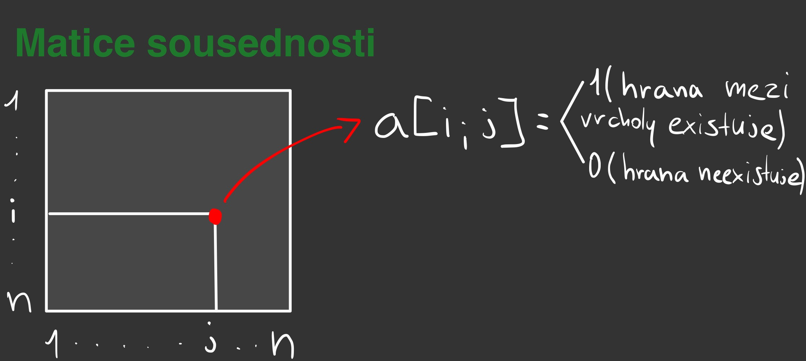
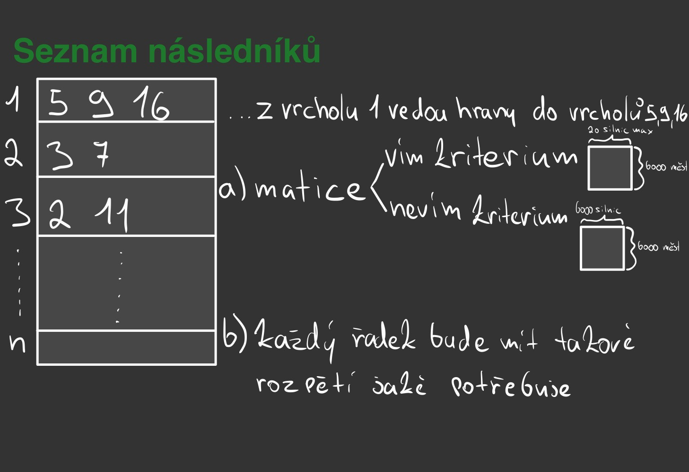
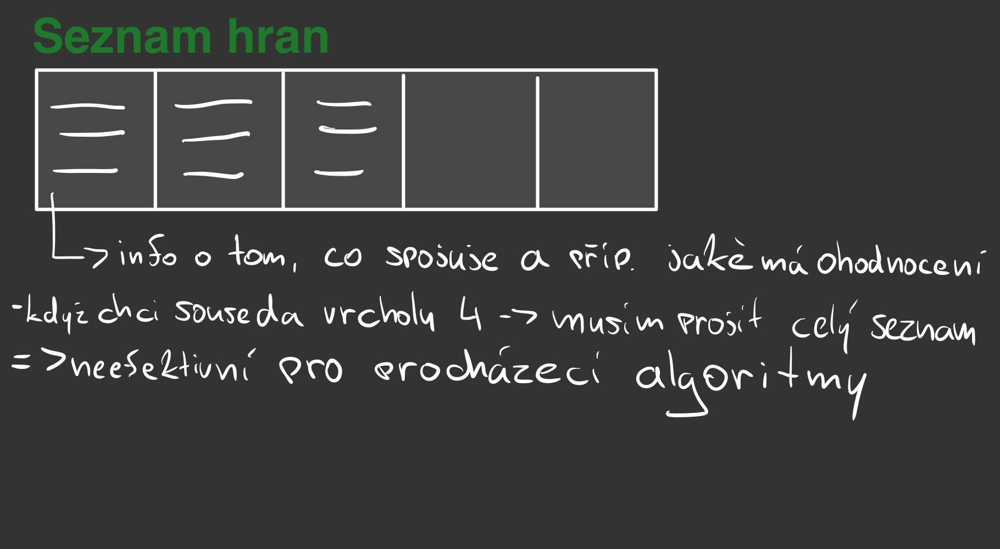

# 07. Grafy – použití

## Obsah
- Reprezentace grafu v programu
- Reprezentace ohodnoceného grafu
- Reprezentace orientovaného grafu
- Reprezentace stromu
- Reprezentace výrazu binárním stromem
- Aritmetické notace (prefix, infix, postfix)
- Vyhodnocení aritmetického výrazu metodou "rozděl a panuj"
- Příklady aplikací

## Reprezentace grafů v paměti

Existuje několik způsobů, jak reprezentovat graf v paměti počítače:

### Matice sousednosti
- Čtvercová matice A o rozměrech n×n (kde n je počet vrcholů)
- A[i][j] = 1, pokud existuje hrana z vrcholu i do vrcholu j, jinak A[i][j] = 0
- U ohodnocených grafů A[i][j] = váha hrany



Vlastnosti:
- Paměťová složitost: O(n²)
- Časová složitost zjištění existence hrany: O(1)
- Vhodné pro husté grafy
- Nevhodné pro řídké grafy (plýtvání pamětí)

**Výhody:**
- Konstantní čas ověření existence hrany O(1)
- Jednoduchá implementace
- Efektivní pro husté grafy

**Nevýhody:**
- Paměťová náročnost O(V²) i pro řídké grafy
- Neefektivní při přidávání nových vrcholů (nutno alokovat novou matici)

**Vhodné pro:**
- Husté grafy (E ≈ V²)
- Malé grafy
- Algoritmy často ověřující existenci hran

### Seznam následníků
- Pro každý vrchol je uchováván seznam sousedních vrcholů
- Může být implementováno jako pole seznamů nebo dynamické datové struktury



Vlastnosti:
- Paměťová složitost: O(n + m), kde m je počet hran
- Časová složitost zjištění existence hrany: O(stupeň vrcholu)
- Vhodné pro řídké grafy
- Efektivní pro procházení sousedů vrcholu

**Implementace:**
- Pole nebo seznam (ArrayList) objektů reprezentujících vrcholy
- Každý vrchol obsahuje seznam (nebo jinou kolekci) odkazů na své sousedy

**Výhody:**
- Paměťová efektivita pro řídké grafy (E << V²)
- Rychlý průchod sousedy vrcholu
- Efektivní přidávání vrcholů a hran

**Nevýhody:**
- Pomalejší ověření existence hrany (O(stupeň vrcholu))
- Složitější implementace pro začátečníky

**Vhodné pro:**
- Řídké grafy (s malým počtem hran oproti počtu vrcholů)
- Algoritmy, které často procházejí sousedy (BFS, DFS)

### Seznam hran
- Seznam všech hran grafu, kde každá hrana je reprezentována dvojicí (nebo trojicí u ohodnocených grafů) indexů vrcholů

Vlastnosti:
- Paměťová složitost: O(m)
- Jednoduchá implementace
- Vhodné pro některé algoritmy (např. Kruskalův algoritmus)
- Nevhodné pro zjišťování sousedů vrcholu

**Implementace:**
- Seznam nebo pole objektů hran
- Každá hrana obsahuje odkaz na dva vrcholy, které spojuje

**Výhody:**
- Jednoduchá implementace
- Paměťová efektivita pro velmi řídké grafy
- Snadné procházení všech hran

**Nevýhody:**
- Pomalé ověření existence hrany O(E)
- Pomalé nalezení všech sousedů vrcholu O(E)

**Vhodné pro:**
- Algoritmy pracující především s hranami (např. Kruskalův algoritmus)
- Velmi řídké grafy  
  


### Matice Incidence
- Matice o rozměrech n×m (n vrcholů, m hran)
- Pro neorientovaný graf: A[i][j] = 1, pokud vrchol i náleží hraně j, jinak 0
- Pro orientovaný graf: A[i][j] = 1, pokud hrana j vychází z vrcholu i, A[i][j] = -1, pokud hrana j vstupuje do vrcholu i, jinak 0

Vlastnosti:
- Paměťová složitost: O(n×m)
- Méně často používaná než předchozí metody
- Topfer: *"V algoritmech se nepoužívá"*

## Reprezentace ohodnoceného grafu

Ohodnocený graf obsahuje číselné hodnoty (váhy) přiřazené hranám nebo vrcholům.

### Ohodnocení hran

**V seznamu sousedů:**
- Kromě odkazu na souseda ukládáme i váhu hrany
```
class Vrchol {
    id
    seznam_sousedů    // seznam objektů {soused, váha}
}
```

**V matici sousednosti:**
- Místo boolean hodnot ukládáme váhy hran
- Speciální hodnota (např. ∞ nebo -1) pro neexistující hrany
```
class Graf {
    velikost
    matice[velikost][velikost]    // hodnoty: váha hrany nebo ∞ pro neexistující hranu
}
```

**V seznamu hran:**
- Přidáme váhu jako další atribut hrany
```
class Hrana {
    vrchol_začátek
    vrchol_konec
    váha
}
```

### Ohodnocení vrcholů

**Přidání atributu k vrcholu:**
- Jednoduchý způsob reprezentace hodnot vrcholů
```
class Vrchol {
    id
    hodnota           // ohodnocení vrcholu
    seznam_sousedů
}
```

## Reprezentace orientovaného grafu

Orientovaný graf obsahuje hrany s určeným směrem (od jednoho vrcholu k druhému).

**V seznamu sousedů:**
- Seznam obsahuje pouze vrcholy, do kterých vede hrana
- Pro rychlý přístup k "přicházejícím" hranám můžeme udržovat i seznam "předchůdců"
```
class Vrchol {
    id
    seznam_následníků     // vrcholy, do kterých vede hrana
    seznam_předchůdců     // volitelně: vrcholy, ze kterých vede hrana do tohoto
}
```

**V matici sousednosti:**
- M[i][j] = 1, pokud existuje hrana z i do j
- M[j][i] nemusí být 1, i když M[i][j] = 1
- Matice nemusí být symetrická
```
class Graf {
    velikost
    matice[velikost][velikost]   // M[i][j] = 1, pokud existuje hrana z i do j
}
```

**V seznamu hran:**
- Explicitně rozlišujeme počáteční a koncový vrchol hrany
```
class Hrana {
    vrchol_od        // počáteční vrchol
    vrchol_do        // koncový vrchol
}
```

## Reprezentace stromu

Strom je speciální typ grafu, který nemá cykly a je souvislý.

### Obecný strom

**Reprezentace rodič-dítě:**
- Každý uzel má odkaz na svého rodiče a seznam dětí
```
class Uzel {
    hodnota
    rodič            // odkaz na rodičovský uzel
    seznam_dětí      // seznam odkazů na děti
}
```

### Binární strom

**Standardní reprezentace:**
- Každý uzel má nejvýše dva potomky (levé a pravé dítě)
```
class UzelBinarnihoStromu {
    hodnota
    leve_dite        // odkaz na levé dítě
    prave_dite       // odkaz na pravé dítě
}
```

**Reprezentace binárního stromu polem:**
- Efektivní pro kompletní stromy (např. halda)
- Pro uzel na indexu i:
  - Levé dítě: 2*i + 1
  - Pravé dítě: 2*i + 2
  - Rodič: (i-1)/2
```
class BinarniStrom {
    pole[]           // pole hodnot nebo uzlů
}
```

## Reprezentace výrazu binárním stromem

Binární strom je přirozený způsob reprezentace aritmetických výrazů:

- **Vnitřní uzly** obsahují operátory (+, -, *, /, ^, atd.)
- **Listy** obsahují operandy (čísla, proměnné)
- **Levý podstrom** je levý operand
- **Pravý podstrom** je pravý operand

### Příklad:
Pro výraz `(3 + 4) * 5`:
```
    *
   / \
  +   5
 / \
3   4
```

### Výhody reprezentace výrazu stromem:
- Přirozené zachování precedence operátorů
- Snadné vyhodnocení rekurzí
- Jednoduchá transformace mezi různými notacemi
- Možnost optimalizace výrazu (zjednodušení, skládání konstant)

## Aritmetické notace

Existují tři základní způsoby zápisu aritmetických výrazů:

### Infixová notace
- Operátor je mezi operandy: `a + b`
- Přirozený způsob zápisu pro lidi
- Vyžaduje závorky nebo pravidla precedence pro jednoznačnost
- Příklad: `(3 + 4) * 5`

### Prefixová notace (polská notace)
- Operátor předchází operandy: `+ a b`
- Nevyžaduje závorky pro jednoznačnost
- Jednoduchá rekurzivní definice
- Příklad: `* + 3 4 5`

### Postfixová notace (obrácená polská notace, RPN)
- Operátor následuje po operandech: `a b +`
- Nevyžaduje závorky pro jednoznačnost
- Přirozená pro vyhodnocení pomocí zásobníku
- Používaná v některých kalkulačkách (HP)
- Příklad: `3 4 + 5 *`

### Převody mezi notacemi

**Infix na postfix** (algoritmus "shunting yard"):
1. Procházíme infixový výraz zleva doprava
2. Pokud je token operand, přidáme ho do výstupu
3. Pokud je token operátor:
   - Vyskládáme ze zásobníku operátory s vyšší nebo stejnou precedencí
   - Vložíme aktuální operátor na zásobník
4. Pro levou závorku vložíme ji na zásobník
5. Pro pravou závorku vyskládáme operátory ze zásobníku až po levou závorku
6. Na konci vyskládáme zbývající operátory ze zásobníku

**Postfix na infix:**
- Použití zásobníku pro operandy
- Při čtení operátoru se vytvoří výraz z posledních dvou operandů

**Převody pomocí stromu:**
1. Z libovolné notace sestavíme strom výrazu
2. Procházením stromu různými způsoby získáme různé notace:
   - Infix: inorder průchod (levý podstrom, kořen, pravý podstrom)
   - Prefix: preorder průchod (kořen, levý podstrom, pravý podstrom)
   - Postfix: postorder průchod (levý podstrom, pravý podstrom, kořen)

## Vyhodnocení aritmetického výrazu metodou "rozděl a panuj"

Metoda "rozděl a panuj" (divide and conquer) je obecný algoritmus řešení problémů, který:
1. Rozdělí problém na menší podproblémy
2. Rekurzivně vyřeší podproblémy
3. Zkombinuje řešení podproblémů do řešení původního problému

### Vyhodnocení výrazu pomocí binárního stromu:

```
function vyhodnoť(uzel):
    pokud uzel je list:
        return hodnota_listu
    jinak:
        levá_hodnota = vyhodnoť(uzel.levé_dítě)
        pravá_hodnota = vyhodnoť(uzel.pravé_dítě)
        return aplikuj_operátor(uzel.operátor, levá_hodnota, pravá_hodnota)
```

### Vyhodnocení postfixového výrazu pomocí zásobníku:

```
function vyhodnoť_postfix(výraz):
    zásobník = prázdný zásobník
    
    pro každý token ve výrazu:
        pokud token je operand:
            push(zásobník, token)
        pokud token je operátor:
            pravý_operand = pop(zásobník)
            levý_operand = pop(zásobník)
            výsledek = aplikuj_operátor(token, levý_operand, pravý_operand)
            push(zásobník, výsledek)
    
    return pop(zásobník)  // poslední hodnota na zásobníku je výsledek
```

### Vyhodnocení infixového výrazu "rozděl a panuj":

1. Najdi operátor s nejnižší precedencí mimo závorky
2. Rekurzivně vyhodnoť levý a pravý podvýraz
3. Aplikuj operátor na výsledky

```
function vyhodnoť_infix(výraz):
    pokud výraz je číslo:
        return hodnota_čísla
    
    pokud výraz je uzavřen v závorkách:
        return vyhodnoť_infix(výraz_bez_závorek)
    
    operátor, pozice = najdi_operátor_s_nejnižší_precedencí(výraz)
    
    levý_výraz = výraz[0:pozice]
    pravý_výraz = výraz[pozice+1:]
    
    levá_hodnota = vyhodnoť_infix(levý_výraz)
    pravá_hodnota = vyhodnoť_infix(pravý_výraz)
    
    return aplikuj_operátor(operátor, levá_hodnota, pravá_hodnota)
```

## Příklady aplikací

### Syntaktická analýza
- Parsování programovacích jazyků a matematických výrazů
- Kompilace a interpretace kódu

### Výpočet matematických výrazů
- Kalkulačky
- Tabulkové procesory
- Systémy počítačové algebry

### Optimalizace kódu
- Skládání konstant
- Eliminace společných podvýrazů
- JIT kompilátory

### Grafické aplikace
- Vykreslovací stromy (scene graphs)
- Animace a transformace

### Datové struktury
- Vyhledávací stromy
- Indexy databází
- Navigační systémy
